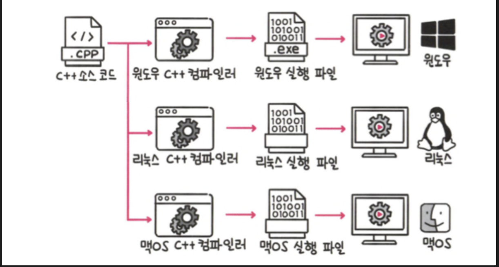
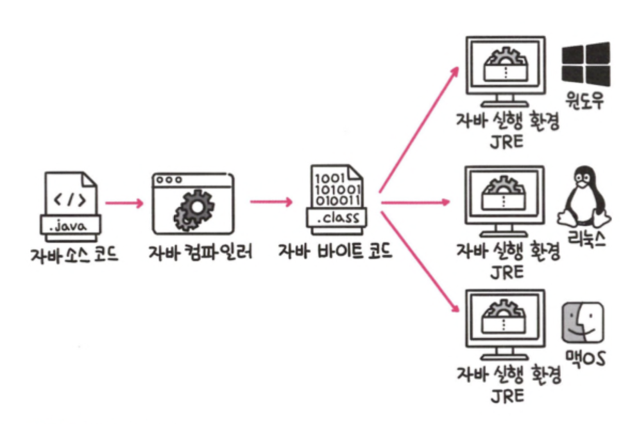
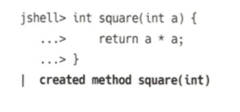

- 라이브러리 풍부
- 자바이전
	- C언어가 대세
		- 절차형 프로그래밍 언어
		- 코드 복잡, 가독성 떨어져 유지보스 어려움
	- 이를 극복한것이 자바의 oop
		- 캡슐화
			- 변수와 함수를 클래스라는 단위로 묶어 따로 분리해 처리
			- 변수에 직접 접근하지 않고 메소드로 변경,조회
			- 내부에서 변수명을 바꾸는 변화가 있어도 외부 메소드는 변화가 없어 의존성이 낮다
		- 추상화
			- 적절한 추상화는 중요하지만 지나치면 코드를 이해하기 어렵다
		- 상속
		- 다형성
			- 오버로딩, 오버라이딩
	- C에 클래스개념을 도입한 C++
- 자바의 빌드와 실행
	- c++
		- 컴파일러가 소스파일을 읽어들이고 해당 운영체제에 최적화된 바이너리를 한번에 만들어냄
		- 운영체제에 따라 컴파일러가 다르기때문에 동일한 소스코드라도 다른 실행파일이 만들어지고 다르게 작동할수있다.
		- 컴파일러가 다르기 때문에 각 운영체제에 맞추어 각각 개발해야함
		- 
	- 자바
		- 컴파일러와 실행환경을 분리
			- 바이트코드라는 표준 중간 계층를 만듬
			- 컴파일러는 바이트코드까지만 만들고 실행환경은 각각의 운영체제에서 동작하는 방식이다. 그러므로 컴파일러는 하나만 있어도 된다.
			- 컴파일러를 개발하는게 아닌 바이트코드를 동작시키는 jre만 개발하면된다
			- 
			어떤 운영체제든 jre만 구현하면 자바의 컴파일러나 여러 도구의 이점을 그대로 활용할수있다.
	- 자바의 빌드와 실행
		1. 자바 소스 파일(java)을 자바컴파일러(javac)가 컴파일하여 바이트코드를 만든다.
		2. 각 운영체제별 jre에서 jvm을 통해 바이트코드를 운영체제에 맞게 해석하여 실행한다.
		- 어떤언어든간에 자바 바이트코드를 만들어내고 Jvm쓰면 자바처럼 wora 가능
			- ->컴파일러의 프론트엔드 역할만 구현하면 됨
			- 자이썬 : 파이썬의 jvm버전
			- 제이루비 : 루비의 jvm버전
			- 스칼라 : 위 언어들과 달리 jvm전용으로 시작
				- 학계에서 창안 순수성강조해 사용하기 어려움
			- 그루비
			- 클로저
			- 코틀린(구글의 공식언어)
	- jre의 구조
		- 라이브러리
			- 자바 컬렉션 프레임워크
			- 기본 패키지
		- jvm
			- 바이트코드를 각 운영체제에 맞게 실행해주는 역할

- 코테에선 무엇을 사용하지 않는가
	- 자바는 OOP를 강조해 코드가 장황/문법 복잡
	- 대형프로젝트에는 문제가 안되지만 간결한 코테에는 불리함
	- 코테에서는 OOP 개념 보단 함수형이나 절차적인 방식으로 작성
		- 실무에서 매우 중요한 OOP는
		- 캡슐화, 추상화(복잡도 커짐),상속(재사용할만한 경우 없),다형성 쓸일이 없다
		- 실무에서 매우 중요한 접근제어자도 중요치 않다.    
		- 
			
- 코테에선 무엇을 사용하는가
	- 제네릭, 함수형 
		- 제네릭: 사용할 자료형을 명시해 컴파일 시점에 타입검사하게함
			- 에러시점: 런타임 -> 컴파일
			- List<자료형> name= new ArrayList<>();
				- 변수선언에만 타입을 기술하고 
				- 객체에는 타입선언을 생략하고 <> 형태만 기입
		- 함수형: 람다식
			- (파라미터)->내용
		- 스트림API
			1. 순회하면서 리스트에 멤버삽입
			2. 순회하면서 값을 찾기
			3. 순회하면서 정렬
			4. 순회하면서 출력
			- 이 4가지 for문을 스트림을 이용하면 한번의 과정으로 처리할수있다
			 각 요소를 한 번만 순회하면서 원하는 작업을 모두 수행할 수 있다.
		- 메소드 참조
			- 특정 메소드의 참조를 파라미터로 전달
				- 프로그래밍에서 특정 메서드(즉, 어떤 일을 하는 방법)를 다른 코드에서 사용하겠다고 가리키는 것
				-  **forEach**: 리스트의 모든 요소를 하나씩 꺼내서 주어진 작업을 반복 실행하라는 의미.
				- **::** **(메서드 참조)**: 특정 메서드를 사용하라는 의미. 람다 표현식을 더 간단하게 만드는 방법.
		- jshell
			- 결과를  실시간으로 확인할 수 있는 상호작용.
				- 터미널에 jshell만 입력하면 간단히 실행됨
				- 기본적인 패키지는 이미 임포트가 되어있다
				- 어떤결과가 나올지 모호할때 확인 가능
					- ex) 'z'-'a'
						- 25
					- 변수 선언, 출력문이 없어도 실시간으로 결과 알려줌
				- 메소드를 정의할수도 있다
					
				- 명령어들
					- /methods
						정의한 메소드 확인
					- /vars
						정의한 변수 확인
					- /list
						입력했던 코드 확인
					- /types
						정의한 타입(클래스,인터페이스 등)확인
					- /imports
						임포트 패키지 확인
				- tab 누르면 자동완성해준다
