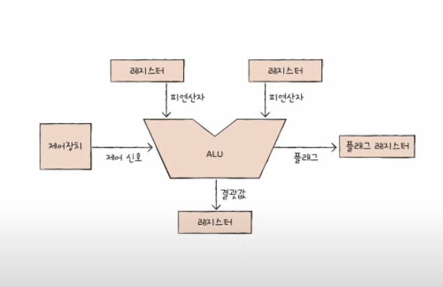
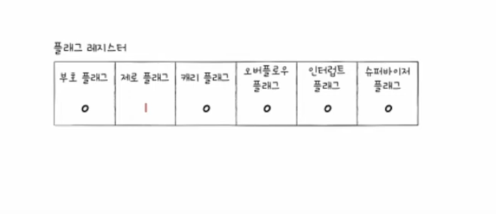
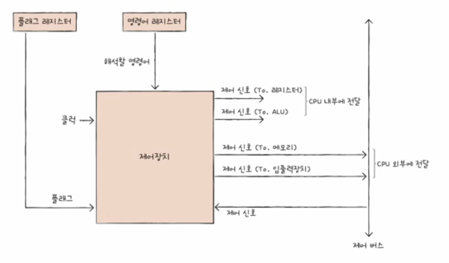

cpu의 구성품인 ALU와 제어장치에 대해 알아보자
- ALU: 계산하는 장치
- 제어장치: 제어신호를 발생시키고 명령어를 해석하는 장치

- ## ALU
	
	- ### ALU는 무엇을 받아들이는가
		- ##### 피연산자
			- 레지스터로부터 피연산자를 받아들이고
		- ##### 제어신호
			- 제어장치로 제어신호를 받아들인다(어떤 연산을 수행할지)
	- ### ALU는 무엇을 내보내는가
		- ##### **계산된 결과값**을 레지스터에 담아준다
			- 왜 메모리가 아닌 레지스터인가?
				- cpu는 메모리보다 cpu내부에 있는 레지스터 접근속도가 빨라서
		- ##### **플래그**를 플래그 레지스터에 담아준다
			- 플래그란 **연산 결과**에 대한 부가 정보
			- 플래그 레지스터는 특수한 레지스터이다
				- 요렇게 생긴 특수한 플래그 레지스터에 담긴다
					- 제로플래그가 1이면 연산결과가 0이구나~ 이런식으로 cpu가 알수있다
					
					- 오버플로우 플래그 : 연산결과가 너무 클때 발생하는 오버플로우를 나타냄
					- 부호 플래그 : 연산한 결과의 부호를 나타낸다
						- 음수,양수 모두 0과1인데 cpu가 어떻게 구분해?의 어떻게임
					- 제로 플래그 : 연산 결과가 0인지 여부를 나타낸다
					- 캐리 플래그 : 연산결과 올림수나 빌림수가 발생했는지를 나타낸다
					- 인터럽트 플래그 : 인터럽트가 가능한지를 나타낸다
					- 슈퍼바이저 플래그 : 커널모드로 실행중인지 사용자 모드로 실행중인지 나타낸다
				- (챗지피티)오버플러우 플래그가 저장된다면~?
					1. **ALU**: 연산을 수행하고 결과값과 플래그를 생성합니다.
					2. **레지스터**: 연산 결과값을 저장합니다.
					3. **플래그 레지스터**: 오버플로우 플래그를 포함한 상태 플래그를 저장합니다.
					4. **제어장치**: 플래그 레지스터의 상태를 모니터링하고, 필요한 경우 예외 처리 루틴을 실행합니다.
					5. **예외 처리 루틴**: 오버플로우와 같은 예외 상황을 처리하는 코드를 실행합니다.
	- ## 제어장치
		- 
		- ### 제어장치는 무엇을 받아들이는가
			- ##### 클록신호
				- 모든 부품을 박자에 맞추어 움직일수있는 시간단위
				- 클록신호에 맞춰서 명령어들이 수행된다고 생각하기
			- ##### 해석할 명령어
				- 명령어 레지스터라는 특수한 레지스터에 저장이 되어있는 명령어를 받아들여 해석한다.
			- ##### 플래그
				- cpu가 연산결과로서 받아들이는 부가정보
				- 명령어를 해석하는 과정에서 플래그는 필요하니까~
			- ##### 제어신호
				- 제어장치가 제어신호를 발생시킨다고 하지만
					cpu만 제어신호 발생시키는게 아니다 주변장치도 제어신호를 발생시킬수있다
					주변장치에서 신호 발생해서 cpu에 전달이 됬다면 이신호는 어떤신호인지를 제어장치가 받아들임 
		- ### 제어장치는 무엇을 내보내는가
			- ##### 제어신호(cpu 내부에 전달할)
				- 레지스터에 전달
					- 레지스터의 동작을 지시
				- ALU에 전달
					- 수행할 연산을 지시
			- ##### 제어신호(cpu 외부에 전달할)
				- 메모리에 전달
					- 메모리 동작을 지시
				- 입출력장치에 전달
					- 입출력장치의 동작을 지시

주변장치에서 발생한 제어신호와 그 이후의 과정에 대해 설명하겠습니다. 이와 관련된 질문들에 대한 답변을 아래에 정리하였습니다.

### 1. 주변장치에 발생한 신호가 무엇이기에 CPU에 전달하는거야?
주변장치에서 발생하는 신호는 주로 **인터럽트**(interrupt) 신호입니다. 이는 주변장치가 CPU에 특정 작업이 필요하다고 알리기 위한 신호입니다. 예를 들어:
- **키보드**: 사용자가 키를 누르면 키보드 컨트롤러가 인터럽트 신호를 CPU에 보냅니다.
- **마우스**: 사용자가 마우스를 움직이거나 클릭하면 마우스 컨트롤러가 인터럽트 신호를 CPU에 보냅니다.
- **디스크 I/O**: 데이터 전송이 완료되면 디스크 컨트롤러가 인터럽트 신호를 CPU에 보냅니다.

### 2. CPU가 뇌니까 CPU한테 전달하는거야?
네, CPU는 컴퓨터 시스템의 중앙 제어 장치로, 모든 중요한 연산과 제어를 담당합니다. 따라서 주변장치가 어떤 요청을 하거나 상태를 알릴 필요가 있을 때 CPU에 신호를 보내는 것은 자연스러운 일입니다. CPU는 이 신호를 받아 적절한 처리를 수행합니다.

### 3. 판단할 장치는 CPU가 유일해?
CPU는 대부분의 시스템에서 최종 판단과 처리를 담당하는 중앙 제어 장치입니다. 그러나 일부 시스템에서는 특정 작업을 분담하기 위해 **DMA (Direct Memory Access)** 컨트롤러와 같은 특수 장치들이 일부 판단과 처리를 수행할 수 있습니다.

### 4. 판단할 장치가 있다면 왜 CPU에 전달해?
주변장치에서 발생한 신호가 CPU에 전달되는 이유는 CPU가 시스템의 중앙 제어 장치로서 모든 주요 작업을 관리하고 조정하기 때문입니다. CPU는 다양한 주변장치의 상태를 모니터링하고, 이를 기반으로 프로그램의 흐름을 제어하며, 필요시 적절한 예외 처리를 수행합니다. 예를 들어:
- **I/O 작업**: 주변장치의 데이터를 처리하거나 전송할 때 CPU가 직접 개입하여 데이터의 이동을 제어합니다.
- **프로그램 흐름 제어**: 인터럽트 신호를 받아 해당 작업을 처리하는 루틴으로 전환합니다.

### 5. 주변장치에서 제어신호가 발생하고 그 이후의 과정

1. **신호 발생**:
   - 주변장치에서 인터럽트 신호가 발생합니다. 예를 들어, 키보드를 누르면 키보드 컨트롤러가 인터럽트 신호를 생성합니다.

2. **신호 전달**:
   - 인터럽트 신호는 시스템 버스를 통해 CPU로 전달됩니다.

3. **인터럽트 처리**:
   - CPU는 현재 실행 중인 작업을 일시 중지하고 인터럽트 신호를 처리합니다.
   - 인터럽트 벡터 테이블을 참조하여 해당 인터럽트를 처리하는 루틴의 시작 주소를 찾습니다.
	   - **1. 일시 중단하면 안되는 거 아니야? 중요한 작업이면 어떡해?**
		
		인터럽트는 시스템의 중요한 사건에 즉각적으로 반응하기 위해 설계된 메커니즘입니다. 그러나 모든 인터럽트가 즉시 처리될 필요는 없습니다. 이를 관리하기 위해 인터럽트에는 우선순위가 설정되어 있습니다.
		
		  
		
		• **우선순위**: 높은 우선순위의 인터럽트는 즉시 처리되고, 낮은 우선순위의 인터럽트는 대기할 수 있습니다.
		
		• **마스킹**: 특정 중요한 작업이 수행 중일 때는 인터럽트를 무시(마스킹)할 수 있습니다. 이는 CPU가 중요한 작업이 완료될 때까지 인터럽트 처리 루틴을 실행하지 않도록 합니다.
	
	  
	
	**2. 중지하면 하던 과정까지를 저장하나? 그리고 다시 이어서 하는거야?**
		네, CPU는 인터럽트가 발생했을 때 현재의 작업 상태를 저장하고, 인터럽트 처리가 완료된 후 저장된 상태로 복귀하여 작업을 이어서 수행합니다
		1. **현재 작업 상태 저장**:
		• **레지스터 상태 저장**: 현재 작업의 모든 레지스터 상태(프로그램 카운터, 스택 포인터 등)를 스택에 저장합니다.
		• **프로그램 카운터 저장**: 현재 실행 중인 명령어의 주소를 저장합니다.
		2. **인터럽트 서비스 루틴(ISR) 실행**:
		• CPU는 인터럽트 벡터 테이블을 참조하여 인터럽트 서비스 루틴의 시작 주소를 찾습니다.
		• 해당 주소로 점프하여 인터럽트 서비스 루틴을 실행합니다.
		3. **인터럽트 처리**:
		• 인터럽트 서비스 루틴에서 필요한 처리를 수행합니다. 예를 들어, 키보드 입력을 읽거나, 타이머 값을 갱신하는 등의 작업을 합니다.
		4. **원래 작업 상태 복구**:
		• 인터럽트 처리 후, 스택에 저장된 레지스터 상태를 복구합니다.
		• 프로그램 카운터를 복구하여 중단된 지점부터 작업을 재개합니다.
		  
	
