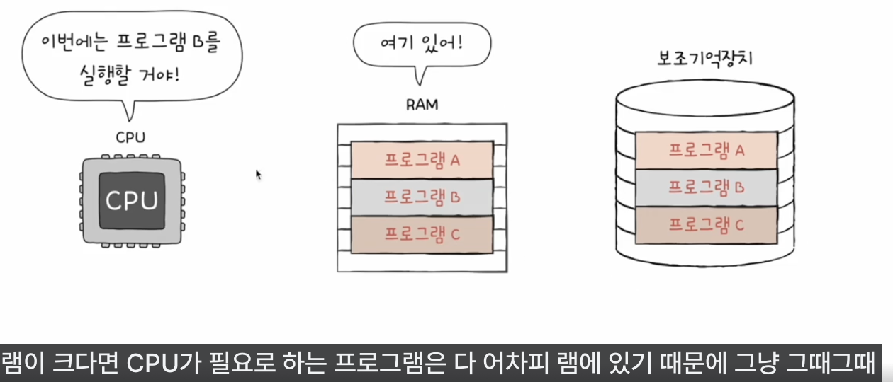

- 주기억장치(Main Memory의 한글화)의 종류
	- RAM
		- '메모리'라고 주로 지칭함
	- ROM

기억나니? cpu는 ram 즉 메모리 부터 명령어와 데이터들을 가져와 실행하고
램은 실행할 대상을 저장하고 그치만 전원이 꺼지면 내용 사라짐
그래서 전원이 꺼져도 내용 기억하는 대용량 보조기억장치 필요

즉 ram은 실행할 대상을 저장하고 보조기억장치는 보관할 대상을 저장한다.

### RAM이 크면 뭐가 좋을까
- RAM의 용량은 컴퓨터 성능에 어떤 영향을 미칠까
- 만약에 ram이 프로그램 하나만 저장가능 하다면??
	- 프로그램 A를 실행하고 싶을땐 
		- RAM이 보조기억장치의 프로그램 A를 복사해 저장
		- CPU가 RAM에 저장된 프로그램을 가져와 실행
	- 즉 새로운 프로그램을 실행할때마다 새롭게 보조기억장치로부터 램에 복사해 cpu로 가지고 와야함
	- 
	- 즉 cpu가 한번에 여러개의 프로그램을 동시해 실행하는 성능이 떨어지게 됨
- 극단적으로 RAM이 크다면?
	- 많은 프로그램들을 동시에 실행하는데 유리
	- 
- 비유하자면 
	- 책장에 있는 책들을 가져와 읽을때 책상이 클수록 유리하다
	- 책장이 크다면 책장에 왔다갔다하며 책을 가져올 필요가 없다
	- 보조메모리에 있는 프로그램들을 가져와 실행할때 RAM이 클수록 유리하다
### RAM의 종류와 차이
- DRAM (Dynamic RAM)
- SRAM
- SDRAM
- DDR SDRAM