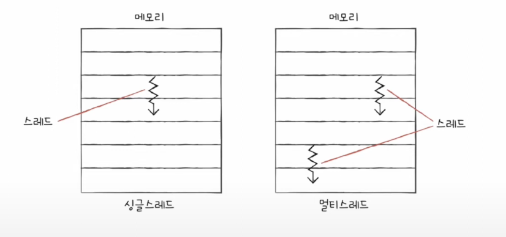
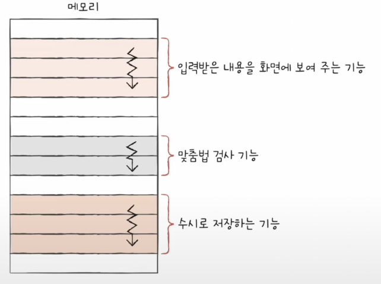

- ## cpu의 속도를 빨리 만드는 법
	1. 클럭 신호를 빠르게 만든다
		- 컴퓨터 부품들은 '클럭 신호'에 맞춰 움직인다.
		- cpu는 '명령어 사이클' 이라는 정해진 흐름에 맞춰 명령어들을 실행한다.
		- 클럭 신호를 빠르게 만들면 명령어 사이클도 빨라진다
		- 일반적으로 통하는 방법이다.
		- 클럭 속도
			- 1초에 반복되는 횟수를 헤르츠 단위(Hz)로 측정
			- 1초에 한번 반복되면 1Hz
			- 일반적으로 cpu는 25억Hz이다
			- cpu는 일정한 클럭 신호를 유지하는게 아니라 유도리있게 속도를 조절한다.
		- 그러나 필요 이상으로 클럭을 높이면 발열이 심각해짐
	2. 코어 수를 늘린다
		- 명령어를 실행하는 부품
			- 전통적 : CPU 하나 ->싱글코어 
			- 오늘날 : CPU 안에는 여러개 존재 그것이 바로 코어.
				
		- 그러나  속도는 코어 수에 비례하여 무조건 증가하지 않는다 (ex) 조별과제)
			- 적절한 작업 분배이느냐에 따라 연산속도가 빨라진다
	3. 스레드 수를 늘린다
		- 하드웨어적 스레드(논리 프로세서)
			- 하나의 코어가 동시에 처리하는 명령어 단위
				- 하나의 코어가 한번에 하나의 명령어를 실행
					- 예) 1 코어 1 스레드 cpu
				-  2개의 코어가 각각 2개씩 명령어를 실행할수있다
					- 예) 2코어 4 스레드 cpu
					- 하나의 코어가 여러 명령어를 처리
						- 예) 멀티 스레드 프로세서, 멀티 스레드 cpu
					- 하이퍼 스레딩
						- 예) 인텔의 멀티스레드기술 
				- 멀티스레드 프로세서를 설계시 가장 큰 핵심은 레지스터.
					- 하나의 명령어를 실행하기 위해 필요한 레지스터들의 묶음을 여러개 갖고 있으면 하나의 코어가 여러 명령어를 동시에 처리할 수 있다.
					- 프로그램 카운터가 2개면 다음에 실행할 명령어의 주소를 2개 지정할수있다
					- 스택 포인터가 2개면 2개의 스택을 관리할수있다.
			- 논리 프로세서라고도 불린다
				- 코어가 몇개인지 스레드가 몇개인지는 cpu만 알고있지 메모리 안에있는 프로그램이 알수는 없다.
				- 그래서 하드웨어 스레드는 메모리가 느끼는 논리적인 프로세서(cpu의 개수)라 부른다(실제 프로세서의 개수는 아니지만)
				- 프로세서vs스레드
					- 프로세서
						- cpu라고 불리는 연산을 수행하는 중심 장치
						- 구성요소
							- 코어: 연산을 실제로 수행하는 독립적인 처리장치
							- 캐시메모리: cpu내부에 있는 고속메모리
							- 컨트롤 유닛: 명령어의 해석및 실행순서를 제어
							- 연산 유닛: 산술및 논리 연산을 수행
						- 유형
							- 싱글코어 프로세서: 하나의 코어를 가진 프로세서
							- 멀티코어 프로세서: 여러개의 코어를 가진 프로세서
					- 스레드
						- 프로세스 내에서 실행되는 가장 작은 단위
						- 하나의 프로세스가 여러개의 스레드를 가질 수 있음
						- 한 프로세스 내에서 병렬로 작업을 수행할 수 있게 하여, 프로그램의 효율성과 성능을 높임
						- 구성요소
							- 프로그램 카운터 : 다음에 실행할 명령어의 주소를 저장
							- 레지스터 : 연산에 필요한 데이터를 저장
							- 스택: 함수 호출 시의 지역변수와 리턴 주소를 저장
						- 하드웨어 스레드: 물리적으로 cpu 코어에서 실행되는 스레드
						- 소프트웨어 스레드 : 운영체제에서 관리하는 논리적인 실행단위
		- 소프트웨어적 스레드
			- 하나의 프로그램에서 독립적으로 실행되는 단위
				- ex)
					1)  사용자로부터 입력받은 내용을 화면에 보여주는 기능
					2)  입력받은내용 맞춤법 검사
					3)  입력받은 내용 수시로 저장
				
				- 싱글 스레드
					- 한 프로그램에서 하나의 실행 흐름이 순차적으로 실행된다
				- 멀티 스레드
					- 한 프로그램에서 동시에 두개 이상의 실행흐름이 순차적으로 실행된다.
		- ### 1코어 1스레드 cpu도 여러 소프트웨어적 스레드를 만들 수 있다.
			- cpu는 내부적으로 엄청 빠르게 번갈아 실행하기때문에
			- 하드웨어 스레드는 하나일지라도 소프트웨어 스레드는 여러개 만들수가 있다.
